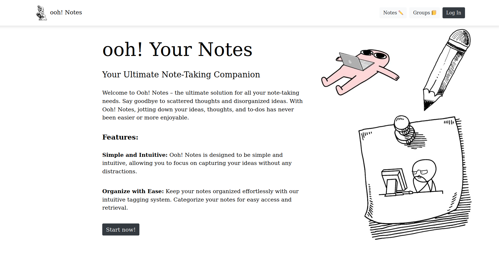

# Note-taking app "ooh! Notes"

This Python **ooh! Notes** Project is a simple application for managing notes with **ooh! Yes** exclamations. 
It allows you to create, view, update, group and delete notes through a user-friendly interface.

## Features

- **Create Notes**: You can create new notes by providing a title, content, optional tags, and resources.
- **View Notes**: All notes are displayed in a list format, along with their associated tags.
- **Search Notes**: You can search for notes using keywords or tags, making it easy to find relevant information.
- **Group Management**: You can manage notes by creating groups.

## Check it out!

Check my project at render: [ooh!-notes](https://ooh-notes.onrender.com/)

Feel free to use next credentials to log in and explore:

- Username: ```PeterPen```
- Password: ```_qw3rty_```

## Installation instructions

I assume you already have Python3 installed.

Too easily use this project, firstly, clone the repository on your desktop:

```shell
git clone https://github.com/aLEKS-e3/ooh-notes.git
```

Then open it in your IDE and write down following commands in terminal:

```shell
python -m venv venv
source venv/bin/activate  # for Windows: venv\scripts\activate
pip install -r requirements.txt
python manage.py migrate
python manage.py collectstatic
python manage.py runserver
```

Also, if you want to test, I have prepared some data for you!:

```shell
python manage.py loaddata notes_db.json
```

## Have a nice experience!


